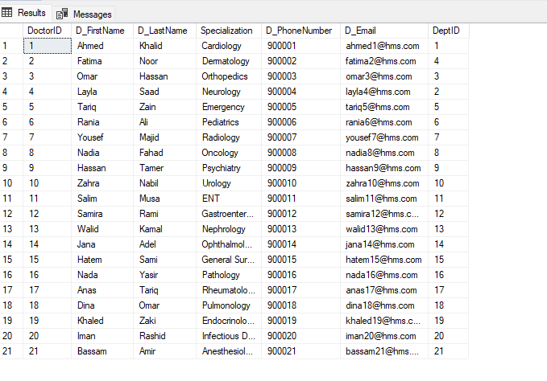
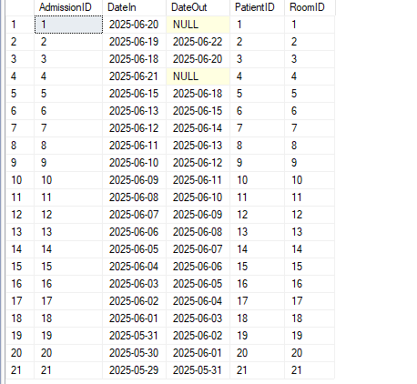
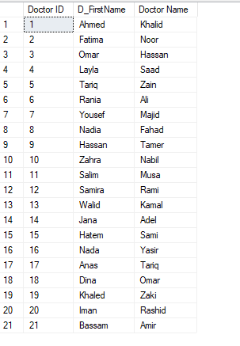

# ═════ ✦Hospital Management System ✦ ═════  

✨ <ins>**Project Objective:**</ins>  

Design and implement a SQL database for a hospital system that supports managing patients, doctors,
appointments, departments, admissions, billing, and staff, to apply all SQL categories (DDL, DML, DQL, DCL, TCL),
normalization, and advanced features like views, functions, stored procedures, and triggers.

✨ <ins>**Database Design Requirements:**</ins>

 **1. Entity Relationship Diagram (ERD):** 

An Entity Relationship (ER) Diagram is a type of flowchart that illustrates how “entities” such as people, objects or concepts relate to each other within a system.

  

**2. Database Mapping:** 

Convert entities, relationships, and attributes into a working relational schema

       

**3. Normalization:**

Normalization is the process of organizing data in a database to:

Reduce redundancy (replication)

Avoid anomalies (renewal, deletion, and deletion issues)

Improve data integrity

1. First Normal Form (1NF): 

★ Each table has a primary key.

★ Each column contains atomic (indivisible) values (no repeating groups or arrays).

★ Each field contains only one value.

2.  Second Normal Form (2NF): 

★ Must be in 1NF.

★ No partial dependency: Each non-key column must be completely dependent on the primary key (not just partially).

3. Third Normal Form (3NF):

★ Must be in 2NF.

★ No transitive dependency: This means that each non-key column depends only on the primary key, and not on any other non-key column.

  

------------------------------------------------------
✨ <ins>**Tables (DDL):**</ins>

Each table must have appropriate constraints:

★ PRIMARY KEY, FOREIGN KEY, NOT NULL, UNIQUE, CHECK, DEFAULT

**CREATE THE DATABASE WITH NAME** 

            CREATE DATABASE HospitalManagementSystem 

**USE THE DATABASE** 

             USE HospitalManagementSystem 

**DDL (CREATION OF ALL TABLES)** 

**tO CREATE Patients TABLE** 

     CREATE TABLE Patients (
    PatientID INT PRIMARY KEY,
     P_FirstName VARCHAR(50),
    P_LastName VARCHAR(50),
    DOB DATE,
    Gender VARCHAR(10),
    P_PhoneNumber VARCHAR(20),
    
     );

**TO CREATE DOCTORS TABLE**  

    CREATE TABLE Doctors (
    DoctorID INT PRIMARY KEY,
    D_FirstName VARCHAR(50),
    D_LastName VARCHAR(50),
    Specialization VARCHAR(100),
    D_PhoneNumber VARCHAR(20),
    D_Email VARCHAR(100),
    DeptID INT,
    FOREIGN KEY (DeptID) REFERENCES Departments(DeptID)
     );

**TO CREATE DEPARTMENT TABLE** 

    CREATE TABLE Departments (
    DeptID INT PRIMARY KEY,
    DeptName VARCHAR(100) NOT NULL
     );

**TO CREATE Appointments TABLE** 

    CREATE TABLE Appointments (
    AppointmentID INT PRIMARY KEY,
    AppointmentDate DATETIME,
    Status VARCHAR(50),
    PatientID INT,
    DoctorID INT,
    FOREIGN KEY (PatientID) REFERENCES Patients(PatientID),
    FOREIGN KEY (DoctorID) REFERENCES Doctors(DoctorID)
    );

**TO CREATE Admissions TABLE** 

    CREATE TABLE Admissions (
    AdmissionID INT PRIMARY KEY,
    DateIn DATE,
    DateOut DATE,
    PatientID INT,
    RoomID INT,
    FOREIGN KEY (PatientID) REFERENCES Patients(PatientID),
    FOREIGN KEY (RoomID) REFERENCES Rooms(RoomID)
    );

**TO CREATE Rooms TABLE** 

    CREATE TABLE Rooms (
    RoomID INT PRIMARY KEY,
	Type VARCHAR(20),
    Available VARCHAR(5)
    );

**TO CREATE MedicalRecords TABLE** 

    CREATE TABLE MedicalRecords (
    RecordID INT PRIMARY KEY,
    Diagnosis VARCHAR(255),
    TreatmentPlan VARCHAR(255),
    Date DATE,
    Notes TEXT,
    PatientID INT,
    DoctorID INT,
    FOREIGN KEY (PatientID) REFERENCES Patients(PatientID),
    FOREIGN KEY (DoctorID) REFERENCES Doctors(DoctorID)
    );

**TO CREATE Users TABLE** 

    CREATE TABLE Users (
    UserID INT PRIMARY KEY,
    Username VARCHAR(50),
    Password VARCHAR(255),
    StaffID INT NULL,
    DoctorID INT NULL,
    FOREIGN KEY (StaffID) REFERENCES Staff(StaffID),
    FOREIGN KEY (DoctorID) REFERENCES Doctors(DoctorID)
    );

 **TO CREATE Staff TABLE** 

    CREATE TABLE Staff (
    StaffID INT PRIMARY KEY,
    S_FirstName VARCHAR(50),
    S_LastName VARCHAR(50),
    Role VARCHAR(50),
    Shift VARCHAR(20),
    DeptID INT,
    FOREIGN KEY (DeptID) REFERENCES Departments(DeptID)
    );

**TO CREATE Billing** 

    CREATE TABLE Billing (
    BillID INT PRIMARY KEY,
    TotalCost DECIMAL(10, 2),
    Services TEXT,
    Date DATE,
    PatientID INT,
    FOREIGN KEY (PatientID) REFERENCES Patients(PatientID)
    );

**CREATE ALTER (UNIQUE, CHECK, DEFAULT) FOR TABALS**

**ALTER  Patients TABLE**

     ALTER TABLE Patients
     ADD CONSTRAINT CHK_Patient_Gender CHECK (Gender IN ('Male', 'Female'));


**ALTER DOCTORS TABLES** 

    ALTER TABLE Doctors
    ADD CONSTRAINT UQ_Doctor_Email UNIQUE (D_Email);

    ALTER TABLE Doctors
    ADD CONSTRAINT CHK_Doctor_Specialization CHECK (Specialization IS NOT NULL);

**ALTER ROOMS TABLE** 

    ALTER TABLE Rooms
    ADD CONSTRAINT CHK_Room_Type CHECK (Type IN ('ICU', 'General'))


    ALTER TABLE Rooms
    ADD CONSTRAINT DF_IsAvailable DEFAULT 'Yes' FOR Available;

**ALTER Appointments TABLE** 
```SQL
ALTER TABLE Appointments
ADD CONSTRAINT CHK_Appointment_Status CHECK (Status IN ('Confirmed', 'Pending', 'Cancelled'));

ALTER TABLE Appointments
ADD CONSTRAINT DF_Appointment_Status DEFAULT 'Pending' FOR Status;
```

**ALTER Billing TABLE** 

     ALTER TABLE Billing
     ADD CONSTRAINT CHK_Bill_TotalCost CHECK (TotalCost >= 0);

     ALTER TABLE Billing
    ADD CONSTRAINT DF_Bill_TotalCost DEFAULT 0.00 FOR TotalCost;

**ALTER Users TABLE**

    ALTER TABLE Users
    ADD CONSTRAINT UQ_Username UNIQUE (Username);

**ALTER Staff TABLE** 

    ALTER TABLE Staff
    ADD CONSTRAINT CHK_Staff_Shift CHECK (Shift IN ('Morning', 'Evening', 'Night'));

    ALTER TABLE Staff
    ADD CONSTRAINT DF_Staff_Shift DEFAULT 'Morning' FOR Shift;

     ALTER TABLE Staff
    ADD CONSTRAINT DF_Staff_Role DEFAULT 'Staff' FOR Role;

**ALTER MedicalRecords TABLE** 

    ALTER TABLE MedicalRecords
    ADD CONSTRAINT CHK_Record_Date CHECK (Date <= GETDATE());

------------------------------------------------------------------------------------
✨<ins>**INSERT Statements Per Table (DML):**</ins> 

**USE THE DATABASE** 

    USE HospitalManagementSystem 

     GO

   **DML** 

**INSERT Statements Per Table** 

**TO INSERT DATA FOR Departments TABLE** 
```SQL
    INSERT INTO Departments (DeptID, DeptName) VALUES
    (1, 'Cardiology'), (2, 'Neurology'), (3, 'Orthopedics'), (4, 'Dermatology'), (5, 'Emergency'),
    (6, 'Pediatrics'), (7, 'Radiology'), (8, 'Oncology'), (9, 'Psychiatry'), (10, 'Urology'),
    (11, 'ENT'), (12, 'Gastroenterology'), (13, 'Nephrology'), (14, 'Ophthalmology'), (15, 'General Surgery'),
    (16, 'Pathology'), (17, 'Rheumatology'), (18, 'Pulmonology'), (19, 'Endocrinology'), (20, 'Infectious Diseases'),
    (21, 'Anesthesiology');

    SELECT * FROM Departments
```
  

**TO INSERT DATA FOR Doctors THABLE** 
```SQL
 INSERT INTO Doctors (DoctorID, D_FirstName, D_LastName, Specialization,   D_PhoneNumber, D_Email, DeptID) VALUES
(1, 'Ahmed', 'Khalid', 'Cardiology', '900001', 'ahmed1@hms.com', 1),
(2, 'Fatima', 'Noor', 'Dermatology', '900002', 'fatima2@hms.com', 4),
(3, 'Omar', 'Hassan', 'Orthopedics', '900003', 'omar3@hms.com', 3),
(4, 'Layla', 'Saad', 'Neurology', '900004', 'layla4@hms.com', 2),
(5, 'Tariq', 'Zain', 'Emergency', '900005', 'tariq5@hms.com', 5),
(6, 'Rania', 'Ali', 'Pediatrics', '900006', 'rania6@hms.com', 6),
(7, 'Yousef', 'Majid', 'Radiology', '900007', 'yousef7@hms.com', 7),
(8, 'Nadia', 'Fahad', 'Oncology', '900008', 'nadia8@hms.com', 8),
(9, 'Hassan', 'Tamer', 'Psychiatry', '900009', 'hassan9@hms.com', 9),
(10, 'Zahra', 'Nabil', 'Urology', '900010', 'zahra10@hms.com', 10),
(11, 'Salim', 'Musa', 'ENT', '900011', 'salim11@hms.com', 11),
(12, 'Samira', 'Rami', 'Gastroenterology', '900012', 'samira12@hms.com', 12),
(13, 'Walid', 'Kamal', 'Nephrology', '900013', 'walid13@hms.com', 13),
(14, 'Jana', 'Adel', 'Ophthalmology', '900014', 'jana14@hms.com', 14),
(15, 'Hatem', 'Sami', 'General Surgery', '900015', 'hatem15@hms.com', 15),
(16, 'Nada', 'Yasir', 'Pathology', '900016', 'nada16@hms.com', 16),
(17, 'Anas', 'Tariq', 'Rheumatology', '900017', 'anas17@hms.com', 17),
(18, 'Dina', 'Omar', 'Pulmonology', '900018', 'dina18@hms.com', 18),
(19, 'Khaled', 'Zaki', 'Endocrinology', '900019', 'khaled19@hms.com', 19),
(20, 'Iman', 'Rashid', 'Infectious Diseases', '900020', 'iman20@hms.com', 20),
(21, 'Bassam', 'Amir', 'Anesthesiology', '900021', 'bassam21@hms.com', 21);

SELECT * FROM Doctors
```
  

**TO INSERT DATA FOR  Rooms TABLE** 

```SQL
INSERT INTO Rooms (RoomID, Type, Available) VALUES
(1,  'ICU', 'No'), (2, 'General', 'Yes'), (3,  'General', 'Yes'),
(4, 'ICU', 'Yes'), (5, 'General', 'No'), (6, 'ICU', 'Yes'),
(7, 'General', 'Yes'), (8,  'General', 'No'), (9,  'ICU', 'Yes'),
(10,  'General', 'Yes'), (11,  'ICU', 'Yes'), (12,  'General', 'Yes'),
(13,  'ICU', 'No'), (14,  'General', 'Yes'), (15, 'ICU', 'No'),
(16, 'General', 'Yes'), (17,  'ICU', 'Yes'), (18,  'General', 'Yes'),
(19,  'ICU', 'No'), (20,  'General', 'Yes'), (21,  'General', 'Yes');

SELECT * FROM Rooms
```
  

**TO INSERT DATA FOR Patients TABLE** 
```SQL
INSERT INTO Patients (PatientID, P_FirstName, P_LastName, DOB, Gender, P_PhoneNumber) VALUES
(1, 'John', 'Doe', '1990-05-22', 'Male', '99998801'),
(2, 'Jane', 'Smith', '1985-11-12', 'Female', '99998802'),
(3, 'Ali', 'Hassan', '1975-08-01', 'Male', '99998803'),
(4, 'Sara', 'Khan', '1993-03-30', 'Female', '99998804'),
(5, 'Omar', 'Fahad', '1982-09-17', 'Male', '99998805'),
(6, 'Laila', 'Zain', '1995-07-19', 'Female', '99998806'),
(7, 'Khalid', 'Adel', '1988-10-24', 'Male', '99998807'),
(8, 'Noor', 'Salim', '1991-12-01', 'Female', '99998808'),
(9, 'Mohamed', 'Rami', '1980-06-11', 'Male', '99998809'),
(10, 'Amira', 'Walid', '1996-02-28', 'Female', '99998810'),
(11, 'Huda', 'Tariq', '1978-04-14', 'Female', '99998811'),
(12, 'Yousef', 'Karim', '1992-01-07', 'Male', '99998812'),
(13, 'Rania', 'Zaki', '1994-09-13', 'Female', '99998813'),
(14, 'Salma', 'Hatem', '1983-05-10', 'Female', '99998814'),
(15, 'Fadi', 'Nabil', '1976-07-23', 'Male', '99998815'),
(16, 'Mona', 'Anas', '1989-11-05', 'Female', '99998816'),
(17, 'Bassam', 'Yasir', '1986-03-18', 'Male', '99998817'),
(18, 'Amina', 'Omar', '1997-08-30', 'Female', '99998818'),
(19, 'Nader', 'Zain', '1981-01-02', 'Male', '99998819'),
(20, 'Hana', 'Majid', '1990-10-26', 'Female', '99998820'),
(21, 'Ibrahim', 'Adel', '1983-01-09', 'Male', '99998821');

SELECT * FROM Patients
```


  

**TO INSERT DATA FOR Appointments TABLE** 
```sql 
    INSERT INTO Appointments (AppointmentID, PatientID, DoctorID, AppointmentDate, Status) VALUES
    (1, 1, 1, '2025-06-24 09:00:00', 'Confirmed'), (2, 2, 2, '2025-06-24 09:30:00', 'Pending'),
    (3, 3, 3, '2025-06-24 10:00:00', 'Confirmed'), (4, 4, 4, '2025-06-24 10:30:00', 'Cancelled'),
    (5, 5, 5, '2025-06-24 11:00:00', 'Confirmed'), (6, 6, 6, '2025-06-24 11:30:00', 'Pending'),
    (7, 7, 7, '2025-06-24 12:00:00', 'Confirmed'), (8, 8, 8, '2025-06-24 12:30:00', 'Confirmed'),
    (9, 9, 9, '2025-06-24 13:00:00', 'Pending'), (10, 10, 10, '2025-06-24 13:30:00', 'Confirmed'),
    (11, 11, 11, '2025-06-24 14:00:00', 'Confirmed'), (12, 12, 12, '2025-06-24 14:30:00', 'Pending'),
    (13, 13, 13, '2025-06-24 15:00:00', 'Confirmed'), (14, 14, 14, '2025-06-24 15:30:00', 'Confirmed'),
    (15, 15, 15, '2025-06-24 16:00:00', 'Cancelled'), (16, 16, 16, '2025-06-24 16:30:00', 'Pending'),
    (17, 17, 17, '2025-06-24 17:00:00', 'Confirmed'), (18, 18, 18, '2025-06-24 17:30:00', 'Confirmed'),
    (19, 19, 19, '2025-06-24 18:00:00', 'Confirmed'), (20, 20, 20, '2025-06-24 18:30:00', 'Pending'),
    (21, 21, 21, '2025-06-24 19:00:00', 'Confirmed');

    SELECT * FROM Appointments
```
     

**TO INSERT DATA FOR Admissions TABLE** 
```sql 
     INSERT INTO Admissions (AdmissionID, PatientID, RoomID, DateIn , DateOut) VALUES
    (1, 1, 1, '2025-06-20', NULL), (2, 2, 2, '2025-06-19', '2025-06-22'),
    (3, 3, 3, '2025-06-18', '2025-06-20'), (4, 4, 4, '2025-06-21', NULL),
    (5, 5, 5, '2025-06-15', '2025-06-18'), (6, 6, 6, '2025-06-13', '2025-06-15'),
    (7, 7, 7, '2025-06-12', '2025-06-14'), (8, 8, 8, '2025-06-11', '2025-06-13'),
    (9, 9, 9, '2025-06-10', '2025-06-12'), (10, 10, 10, '2025-06-09', '2025-06-11'),
    (11, 11, 11, '2025-06-08', '2025-06-10'), (12, 12, 12, '2025-06-07', '2025-06-09'),
    (13, 13, 13, '2025-06-06', '2025-06-08'), (14, 14, 14, '2025-06-05', '2025-06-07'),
    (15, 15, 15, '2025-06-04', '2025-06-06'), (16, 16, 16, '2025-06-03', '2025-06-05'),
    (17, 17, 17, '2025-06-02', '2025-06-04'), (18, 18, 18, '2025-06-01', '2025-06-03'),
    (19, 19, 19, '2025-05-31', '2025-06-02'), (20, 20, 20, '2025-05-30', '2025-06-01'),
    (21, 21, 21, '2025-05-29', '2025-05-31');

    SELECT * FROM Admissions
```
  

**TO INSERT DATA FOR MedicalRecords TABLE** 
```sql
    INSERT INTO MedicalRecords (RecordID, PatientID, Diagnosis,  TreatmentPlan, Date, Notes) VALUES
    (1, 1, 'Hypertension', 'Medication', '2025-06-20', 'Monitor BP daily'),
    (2, 2, 'Diabetes', 'Insulin therapy', '2025-06-19', 'Follow diet plan'),
    (3, 3, 'Fracture', 'Cast', '2025-06-18', 'Recheck in 6 weeks'),
    (4, 4, 'Migraine', 'Painkillers', '2025-06-21', 'Reduce screen time'),
    (5, 5, 'Asthma', 'Inhalers', '2025-06-15', 'Avoid allergens'),
    (6, 6, 'Flu', 'Rest and hydration', '2025-06-13', 'Normal flu symptoms'),
    (7, 7, 'Skin allergy', 'Antihistamines', '2025-06-12', 'Topical ointment'),
    (8, 8, 'Cancer screening', 'Lab tests', '2025-06-11', 'Follow-up next week'),
    (9, 9, 'Anxiety', 'Therapy', '2025-06-10', 'Weekly sessions'),
    (10, 10, 'Kidney stones', 'Medication', '2025-06-09', 'Ultrasound needed'),
    (11, 11, 'Ear infection', 'Antibiotics', '2025-06-08', 'Pain reported'),
    (12, 12, 'Ulcer', 'Antacids', '2025-06-07', 'No spicy food'),
    (13, 13, 'Kidney failure', 'Dialysis', '2025-06-06', 'Check creatinine'),
    (14, 14, 'Eye pain', 'Eye drops', '2025-06-05', 'Reduce screen exposure'),
    (15, 15, 'Appendicitis', 'Surgery', '2025-06-04', 'Successful operation'),
    (16, 16, 'Anemia', 'Iron supplements', '2025-06-03', 'Follow iron diet'),
    (17, 17, 'Arthritis', 'Pain management', '2025-06-02', 'Regular exercise'),
    (18, 18, 'Bronchitis', 'Antibiotics', '2025-06-01', 'Chest X-ray needed'),
    (19, 19, 'Thyroid disorder', 'Hormone therapy', '2025-05-31', 'Follow dosage'),
    (20, 20, 'COVID-19', 'Isolation', '2025-05-30', 'Negative after 10 days'),
    (21, 21, 'Pre-surgery check', 'Blood tests', '2025-05-29', 'Ready for OR');

    SELECT * FROM MedicalRecords
```
  

**TO INSERT DATA FOR Billing TABLE** 
```sql
     INSERT INTO Billing (BillID, PatientID, TotalCost , Date, Services) VALUES
     (1, 1, 150.00, '2025-06-20', 'Consultation'),
     (2, 2, 320.00, '2025-06-19', 'Lab tests'),
    (3, 3, 500.00, '2025-06-18', 'X-Ray, Cast'),
    (4, 4, 100.00, '2025-06-21', 'Neurology review'),
    (5, 5, 250.00, '2025-06-15', 'Asthma treatment'),
    (6, 6, 80.00, '2025-06-13', 'Flu medicine'),
    (7, 7, 120.00, '2025-06-12', 'Skin treatment'),
     (8, 8, 600.00, '2025-06-11', 'CT Scan'),
    (9, 9, 220.00, '2025-06-10', 'Psychiatric consult'),
    (10, 10, 180.00, '2025-06-09', 'Urology review'),
    (11, 11, 90.00, '2025-06-08', 'ENT check'),
    (12, 12, 300.00, '2025-06-07', 'Endoscopy'),
    (13, 13, 700.00, '2025-06-06', 'Dialysis'),
    (14, 14, 110.00, '2025-06-05', 'Ophthalmology'),
    (15, 15, 1000.00, '2025-06-04', 'Surgery'),
    (16, 16, 85.00, '2025-06-03', 'Blood tests'),
    (17, 17, 230.00, '2025-06-02', 'Rheumatology'),
    (18, 18, 190.00, '2025-06-01', 'Pulmonology'),
    (19, 19, 210.00, '2025-05-31', 'Endocrinology'),
    (20, 20, 500.00, '2025-05-30', 'COVID-19 test & isolation'),
    (21, 21, 350.00, '2025-05-29', 'Pre-surgery tests'); 

    SELECT * FROM Billing
```
 

**TO INSERT DATA FOR Users TABLE**
```sql
     INSERT INTO Users (UserID, Username, Password) VALUES
    (1, 'admin1', 'admin123'),
    (2, 'doctor1', 'pass123'),
    (3, 'nurse1', 'nurse123'),
    (4, 'staff1', 'staff123'),
    (5, 'reception1', 'recept123'),
    (6, 'admin2', 'admin456'),
    (7, 'doctor2', 'doc456'),
    (8, 'nurse2', 'nurse456'),
    (9, 'staff2', 'staff456'),
    (10, 'reception2', 'recept456'),
    (11, 'admin3', 'admin789'),
    (12, 'doctor3', 'doc789'),
    (13, 'nurse3', 'nurse789'),
    (14, 'staff3', 'staff789'),
    (15, 'reception3', 'recept789'),
    (16, 'admin4', 'admin321'),
    (17, 'doctor4', 'doc321'),
    (18, 'nurse4', 'nurse321'),
    (19, 'staff4', 'staff321'),
    (20, 'reception4', 'recept321'),
    (21, 'systemadmin', 'sysadmin');

    SELECT * FROM Users
```
  

**TO INSERT DATA FOR Staff TABLE** 
```sql
    INSERT INTO Staff (StaffID, S_FirstName, S_LastName, Role, Shift, DeptID) VALUES
    (1, 'Aisha', 'Salem', 'Nurse', 'Morning', 1),
    (2, 'Hassan', 'Ali', 'Admin', 'Evening', 2),
    (3, 'Omar', 'Kareem', 'Technician', 'Night', 3),
    (4, 'Mona', 'Zaki', 'Receptionist', 'Morning', 4),
    (5, 'Tariq', 'Hani', 'Cleaner', 'Evening', 5),
    (6, 'Lina', 'Fahd', 'Nurse', 'Night', 6),
    (7, 'Majed', 'Rami', 'Security', 'Night', 7),
    (8, 'Noor', 'Saif', 'Nurse', 'Morning', 8),
    (9, 'Yasmine', 'Tamer', 'Admin', 'Evening', 9),
    (10, 'Ahmed', 'Basel', 'Receptionist', 'Morning', 10),
    (11, 'Salma', 'Nour', 'Technician', 'Evening', 11),
    (12, 'Jamal', 'Younis', 'Cleaner', 'Night', 12),
    (13, 'Layla', 'Faris', 'Nurse', 'Morning', 13),
    (14, 'Hussein', 'Ziad', 'Admin', 'Evening', 14),
    (15, 'Nada', 'Walid', 'Security', 'Night', 15),
    (16, 'Ali', 'Samer', 'Receptionist', 'Morning', 16),
    (17, 'Rana', 'Khaled', 'Technician', 'Evening', 17),
    (18, 'Sami', 'Ragheb', 'Cleaner', 'Night', 18),
    (19, 'Dina', 'Hesham', 'Nurse', 'Morning', 19),
    (20, 'Ibrahim', 'Amin', 'Admin', 'Evening', 20),
    (21, 'Waleed', 'Shaker', 'Security', 'Night', 21); 

    SELECT * FROM Staff
```

  

------------------------------------
✨ <ins>**Relational Schema:**</ins> 

```sql
--=====USE THE DATABASE=====

USE HospitalManagementSystem 


--====Relational Schema========

-- SCHEMA: SystemSchema

CREATE SCHEMA SystemSchema;
GO
ALTER SCHEMA SystemSchema TRANSFER Staff;
ALTER SCHEMA SystemSchema TRANSFER Users;
ALTER SCHEMA SystemSchema TRANSFER Departments;


-- SCHEMA: DoctorsSchema
CREATE SCHEMA DoctorsSchema;
GO
ALTER SCHEMA DoctorsSchema TRANSFER Doctors;
ALTER SCHEMA DoctorsSchema TRANSFER Appointments;
ALTER SCHEMA DoctorsSchema TRANSFER MedicalRecords;


-- SCHEMA: ReceptionistSchema
CREATE SCHEMA ReceptionistSchema;
GO
ALTER SCHEMA ReceptionistSchema TRANSFER Rooms;
ALTER SCHEMA ReceptionistSchema TRANSFER Admissions;


--PatientsSchema
CREATE SCHEMA PatientsSchema;
GO
ALTER SCHEMA PatientsSchema TRANSFER Patients;  
ALTER SCHEMA PatientsSchema TRANSFER Billing;

```
------------------------------------------------------

✨ <ins>**Queries to Test (DQL):**</ins>  

 ★ Require students to write SQL queries for:

1.  List all patients who visited a certain doctor

 ```sql 
 SELECT P.P_FirstName, P.P_LastName, A.AppointmentDate

FROM PatientsSchema.Patients P

JOIN DoctorsSchema.Appointments A ON P.PatientID = A.PatientID

WHERE A.DoctorID = 1;
```
  

2. Count of appointments per department.
```sql
SELECT D.DeptName, COUNT(A.AppointmentID) AS AppointmentCount

FROM DoctorsSchema.Appointments A

JOIN DoctorsSchema.Doctors Doc ON A.DoctorID = Doc.DoctorID

JOIN SystemSchema.Departments D ON Doc.DeptID = D.DeptID

GROUP BY D.DeptName;
```
  
 
 3. Retrieve doctors who have more than 5 appointments in a month (e.g., June 2025)
 ```sql
SELECT Doc.D_FirstName, Doc.D_LastName, COUNT(A.AppointmentID) AS TotalAppointments

FROM DoctorsSchema.Doctors Doc

JOIN DoctorsSchema.Appointments A ON Doc.DoctorID = A.DoctorID

WHERE MONTH(A.AppointmentDate) = 6 AND YEAR(A.AppointmentDate) = 2025

GROUP BY Doc.D_FirstName, Doc.D_LastName

HAVING COUNT(A.AppointmentID) >= 1;
```
   


 4. Use JOINs across 3–4 tables
```sql 
SELECT P.P_FirstName AS PatientFirst, Doc.D_FirstName AS DoctorFirst, Dept.DeptName, A.AppointmentDate

FROM PatientsSchema.Patients P

JOIN DoctorsSchema.Appointments A ON P.PatientID = A.PatientID

JOIN DoctorsSchema.Doctors Doc ON A.DoctorID = Doc.DoctorID

JOIN SystemSchema.Departments Dept ON Doc.DeptID = Dept.DeptID;
```
   

5. Use GROUP BY, HAVING, and aggregate functions
```sql
SELECT D.DeptName, COUNT(Doc.DoctorID) AS TotalDoctors

FROM SystemSchema.Departments D

JOIN DoctorsSchema.Doctors Doc ON D.DeptID = Doc.DeptID

GROUP BY D.DeptName

HAVING COUNT(Doc.DoctorID) >= 1;
```
    


6. Use SUBQUERIES and EXISTS 

★ select all doctors who treat 1  patients

```sql 
SELECT Doc.DoctorID as 'Doctor ID', Doc.D_FirstName, Doc.D_LastName AS 'Doctor Name' 

FROM DoctorsSchema.Doctors Doc INNER JOIN DoctorsSchema.Appointments A ON Doc.DoctorID = A.DoctorID
WHERE EXISTS (
SELECT Doc.DoctorID  
FROM DoctorsSchema.Doctors Doc
)
GROUP BY  Doc.DoctorID, Doc.D_FirstName,Doc.D_LastName
HAVING COUNT(A.PatientID) >=1;
```
 

----------------------------------------------
✨ <ins>**Functions & Stored Procedures:**</ins>

★ Require: 

1. Scalar function to calculate patient age from DOB.

```sql
--======Functions & Stored Procedures=====
--1. Scalar function to calculate patient age from DOB

CREATE FUNCTION dbo.fn_CalculateAge (@DOB DATE)
RETURNS INT
AS
BEGIN
RETURN DATEDIFF(YEAR, @DOB, GETDATE()) -
CASE WHEN MONTH(@DOB) > MONTH(GETDATE())
OR (MONTH(@DOB) = MONTH(GETDATE()) AND DAY(@DOB) > DAY(GETDATE()))
THEN 1 ELSE 0 END;
END;
GO

SELECT dbo.fn_CalculateAge(DOB) AS Age
FROM PatientsSchema.Patients;
```
 

2. Stored procedure to admit a patient (insert to Admissions, update Room availability).
```sql 

CREATE PROCEDURE sp_AdmitPatient (
@PatientID INT,
@RoomID INT,
@DateIn DATE,
@DateOut DATE)
AS
BEGIN
INSERT INTO ReceptionistSchema.Admissions (PatientID, RoomID, DateIn,DateOut)
VALUES (@PatientID, @RoomID, @DateIn,@DateOut)

UPDATE ReceptionistSchema.Rooms
SET Available = 'No'
WHERE RoomID = @RoomID;

END;
GO

SELECT * FROM ReceptionistSchema.Rooms WHERE RoomID = 1;
SELECT * FROM ReceptionistSchema.Admissions WHERE PatientID = 1;
```
  

3. Procedure to generate invoice based on treatment

```sql
CREATE PROCEDURE sp_GenerateInvoice
@PatientID INT,
@Service VARCHAR(200),
@TotalCost DECIMAL(10,2),
@Date DATE
AS
BEGIN
INSERT INTO PatientsSchema.Billing (PatientID, Services, TotalCost, Date)
VALUES (@PatientID, @Service, @TotalCost, @Date);
END;
GO

SELECT * FROM PatientsSchema.Billing WHERE PatientID = 1;
```
   

4. Procedure to assign doctor to department and shift.
```sql
CREATE PROCEDURE sp_AssignDoctorToDept

@D_FirstName VARCHAR(50),
@D_LastName VARCHAR(50),
@DeptID INT,
@Shift VARCHAR(20),
@StaffID int
AS
BEGIN
--DECLARE @StaffID INT;

--SELECT @StaffID = StaffID
--FROM SystemSchema.Staff
--WHERE S_FirstName = @D_FirstName AND S_LastName = @D_LastName AND Role = 'Doctor';

IF @StaffID IS NOT NULL
BEGIN
    UPDATE SystemSchema.Staff
    SET DeptID = @DeptID,
        Shift = @Shift
    WHERE StaffID = @StaffID;
END;

END;
GO


exec sp_AssignDoctorToDept
@D_FirstName = 'Aisha',
@D_LastName = 'Salem',
@DeptID  = 1,
@Shift = 'Night',
@StaffID = 1

--drop procedure sp_AssignDoctorToDept


SELECT * FROM SystemSchema.Staff
```


-------------------------------------------------------------
✨ <ins>**Triggers:**</ins>

★ Implement:

1. After insert on Appointments → auto log in MedicalRecords.
```sql
CREATE TRIGGER trg_AfterInsertAppointment
ON DoctorsSchema.Appointments
AFTER INSERT
AS
BEGIN
INSERT INTO DoctorsSchema.MedicalRecords (PatientID, Diagnosis, TreatmentPlan, Date, Notes)
SELECT PatientID, 'To be diagnosed', 'To be decided', GETDATE(), 'Auto-generated after appointment'
FROM inserted;
END;
GO

SELECT * FROM DoctorsSchema.MedicalRecords
WHERE PatientID = 1
ORDER BY Date DESC;
```


2. Before delete on Patients → prevent deletion if pending bills exist.

```sql
CREATE TRIGGER trg_PreventDeletePatientWithBill
ON PatientsSchema.Patients
INSTEAD OF DELETE
AS
BEGIN
IF EXISTS (
SELECT 1 FROM PatientsSchema.Billing B
WHERE B.PatientID IN (SELECT PatientID FROM deleted)
)
BEGIN
RAISERROR ('Cannot delete patient with existing billing records.', 16, 1);
ROLLBACK;
END
ELSE
BEGIN
DELETE FROM PatientsSchema.Patients
WHERE PatientID IN (SELECT PatientID FROM deleted);
END
END;
GO


SELECT DISTINCT P.PatientID, P.P_FirstName, P.P_LastName
FROM PatientsSchema.Patients P
JOIN PatientsSchema.Billing B ON P.PatientID = B.PatientID;
```
```sql
--Patient deletion 
DELETE FROM PatientsSchema.Patients
WHERE PatientID = 1;
```


This means that the trigger is working successfully and preventing the deletion of patients with bills.

```sql
-- Admitting a new patient without bill
INSERT INTO PatientsSchema.Patients (PatientID, P_FirstName, P_LastName, DOB, Gender, P_PhoneNumber)
VALUES (999, 'Test', 'Patient', '1990-01-01', 'Male', '1234567890');
```


```sql
--Delete the patient 
DELETE FROM PatientsSchema.Patients
WHERE PatientID = 999;
```


3. After update on Rooms → ensure no two patients occupy same room.


----------------------------------------------------
✨ <ins>**Security (DCL):**</ins>

1• Create at least two user roles: DoctorUser, AdminUser.

```sql 

CREATE ROLE DoctorUser;
CREATE ROLE AdminUser;

```


2• GRANT SELECT for DoctorUser on Patients and Appointments only.

```sql
GRANT SELECT ON PatientsSchema.Patients TO DoctorUser;
GRANT SELECT ON DoctorsSchema.Appointments TO DoctorUser;
```


3• GRANT INSERT, UPDATE for AdminUser on all tables.


```sql
--SystemSchema
GRANT INSERT, UPDATE ON SystemSchema.Staff TO AdminUser;
GRANT INSERT, UPDATE ON SystemSchema.Users TO AdminUser;
GRANT INSERT, UPDATE ON SystemSchema.Departments TO AdminUser;

-- DoctorsSchema
GRANT INSERT, UPDATE ON DoctorsSchema.Doctors TO AdminUser;
GRANT INSERT, UPDATE ON DoctorsSchema.Appointments TO AdminUser;
GRANT INSERT, UPDATE ON DoctorsSchema.MedicalRecords TO AdminUser;

--ReceptionistSchema
GRANT INSERT, UPDATE ON PatientsSchema.Patients TO AdminUser;
GRANT INSERT, UPDATE ON PatientsSchema.Billing TO AdminUser;


--PatientsSchema
GRANT INSERT, UPDATE ON ReceptionistSchema.Rooms TO AdminUser;
GRANT INSERT, UPDATE ON ReceptionistSchema.Admissions TO AdminUser;
```


4• REVOKE DELETE for Doctors.
